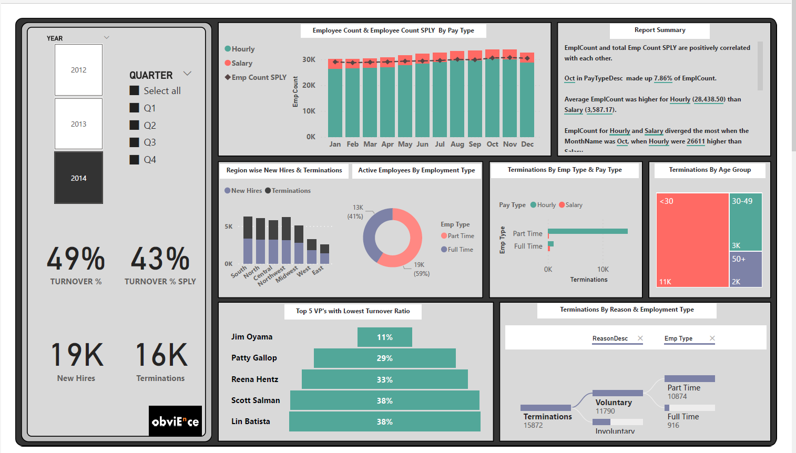
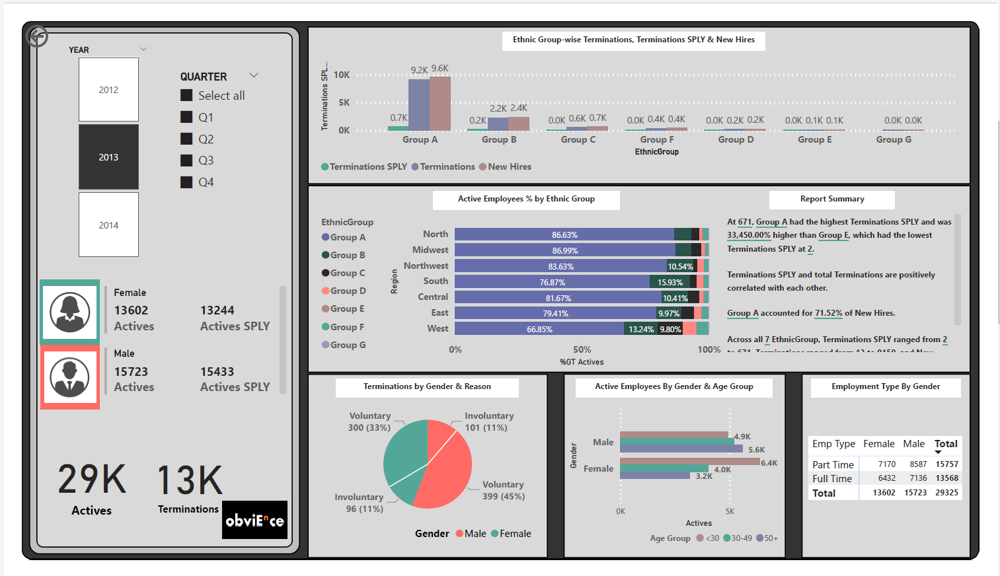
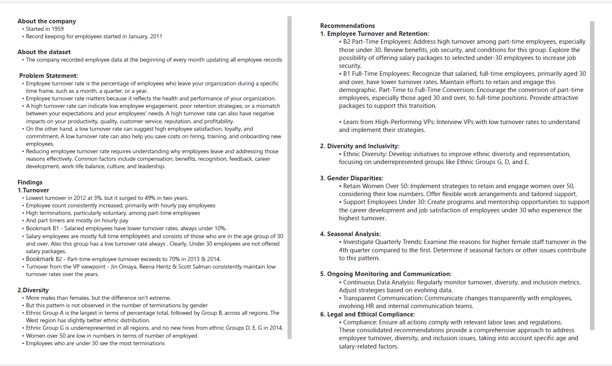

# Employee Hiring & History Data Analytics Project
## About

This project uses the Employee Hiring and History dataset and creates an analysis report for the human resources department.
ELT is performed followed by data visualization in PowerBI

## Problem Statement
Potential merger plans are in progress and the company president seeks an insightful overview of:
* Employee Turnover
* Diversity & Inclusivity

## Technologies Used
* MySQL
* Python
* Pandas package
* DAX Studio
* PowerBI

## Project Architecture

## Visualization & Recommendations

## Project Folders & Reports
* [Project Presentation](documentation/Project_Presentation.pdf) - The plan, design & results
* [PowerBI Report](powerbi/PowerBI_Report.pdf)
* [Extraction via sql](sql)
* [EDA in Python](python) 
* [Visualization in PowerBI](powerbi)
